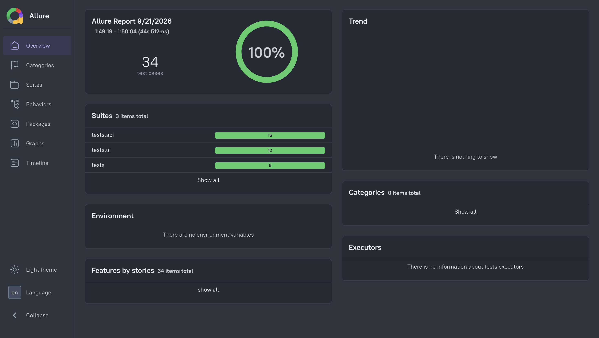
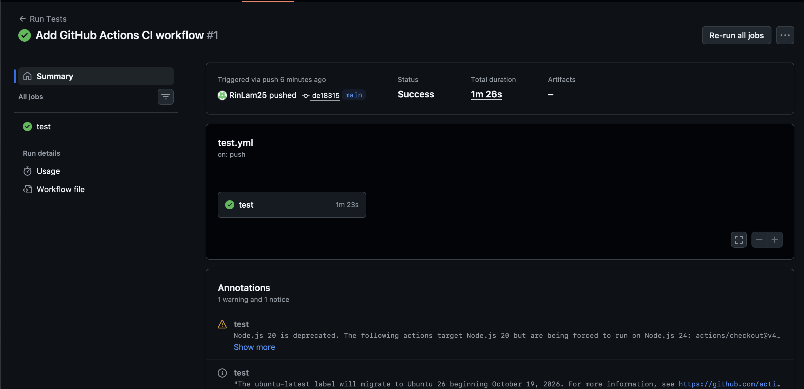
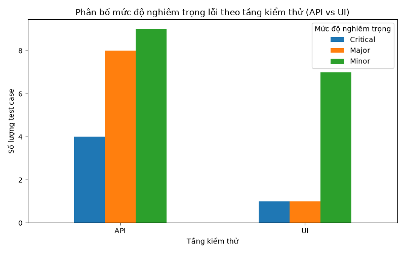

# Python Automation Testing & API Testing Portfolio

Automation testing portfolio project combining **API testing** and **UI testing** (Playwright + Page Object Model) against [automationexercise.com](https://automationexercise.com), with CI/CD integration and a lightweight statistical analysis of defect severity across test layers.

## Overview

This project was built to demonstrate practical automation testing skills for QA/Automation Test roles, while also serving as a small applied data-analysis exercise connecting software quality assessment with statistical methods. It was built from scratch as a first hands-on Python project, with every component (setup, tests, CI/CD, analysis) implemented and understood step by step rather than generated wholesale.

## Tech Stack

| Category | Tools |
|---|---|
| Language | Python 3.13 |
| API Testing | `requests`, `pytest`, `pytest-mock` |
| UI Testing | `Playwright` (Page Object Model), `pytest-playwright` |
| Reporting | Allure Report, `pytest-html` |
| CI/CD | GitHub Actions |
| Data Analysis | `pandas`, `scipy` (Chi-square test), `matplotlib` |
| Exploration | Postman (manual API exploration before automation) |

## Project Structure

```
automation-test-project/
├── .github/workflows/     # CI/CD pipeline (GitHub Actions)
├── analysis/               # Statistical analysis (fault severity vs. test layer)
├── pages/                  # Page Object Model classes
├── tests/
│   ├── api/                 # API tests (requests + pytest, incl. mocking)
│   └── ui/                  # UI tests (Playwright)
├── conftest.py             # Shared fixtures (ad-blocking via network interception)
└── requirements.txt
```

## Test Coverage

- **~50 automated tests** across API and UI layers
- **API tests:** happy path, negative cases (wrong HTTP methods, missing parameters), edge cases (empty strings, special characters, SQL-injection-style input), response time checks, and mocked scenarios (server error, network failure) using `pytest-mock`
- **UI tests:** signup, login, cart (add/remove), category filtering, search (including empty/no-match/non-ASCII input), and basic accessibility checks (alt text, placeholders) — built with a Page Object Model for maintainability
- **Known flakiness:** a small subset of UI tests can occasionally fail (~10-20%) due to a third-party ad (`#google_vignette`) intermittently intercepting on the demo site. Mitigated via `wait_for_timeout` + `Escape` + forced clicks, and more robustly via a `conftest.py` fixture that blocks known ad domains at the network level for all UI tests.

## Running the Tests

```bash
# Setup
python3 -m venv venv
source venv/bin/activate
pip install -r requirements.txt
playwright install

# Run everything
pytest tests/ -v

# Run only API or only UI tests
pytest tests/api/ -v
pytest tests/ui/ -v

# Generate an Allure report
pytest tests/ --alluredir=reports/allure-results
allure serve reports/allure-results
```



## CI/CD

Every push to `main` automatically triggers a GitHub Actions workflow (`.github/workflows/test.yml`) that installs dependencies and runs the full test suite on Ubuntu, giving immediate feedback on whether a change broke anything — without needing to run tests locally first.



## Statistical Analysis: Defect Severity by Test Layer

As a small extension connecting software testing with data analysis, `analysis/fault_analysis.py` examines whether the **testing layer (API vs. UI)** is associated with the **severity of defects/negative cases** identified (Critical / Major / Minor), using a Chi-square test of independence.

**Method:** 30 negative/edge-case tests from this project were manually classified into a severity taxonomy defined for this project (not an external industry standard), based on the hypothetical impact if each test were to fail — e.g., authentication bypass or data-deletion issues as Critical, broken core functionality as Major, and routing/technical or UX-level issues as Minor.

**Result:** p-value = 0.20 (Chi-square = 3.21, df = 2) — at face value, this suggests no statistically significant association between test layer and defect severity in this sample. **However**, 4 of the 6 cells in the expected-frequency table fall below 5, violating the standard assumption for a reliable Chi-square test, largely because the Critical category contains relatively few cases (5 of 30). This result should therefore be read as **exploratory rather than statistically conclusive** — a larger, more balanced sample, particularly of Critical-severity cases, would be needed for a reliable conclusion.



## What I Learned

- How to structure a maintainable UI test suite using the Page Object Model, and why separating locators/actions from test logic matters once a suite grows past a handful of tests
- The practical difference between HTTP-level status codes and application-level response codes in an API's JSON body — and why testing only one can produce a test that always passes regardless of the real outcome
- How and when to use mocking (`pytest-mock`) to test error-handling logic without depending on a live server actually failing
- Debugging real flaky UI tests caused by third-party ads, and comparing reactive fixes (waiting, force-clicking) against a more robust fix (blocking ad domains at the network layer)
- How to read a statistical test result critically: a p-value alone doesn't tell the whole story — checking the test's underlying assumptions (expected cell frequencies) is necessary before trusting the conclusion, especially with a small sample
- Setting up a CI/CD pipeline so that test coverage is verified automatically on every push, rather than relying on remembering to run tests locally

## Author

Lam The Rin — [GitHub](https://github.com/RinLam25)
